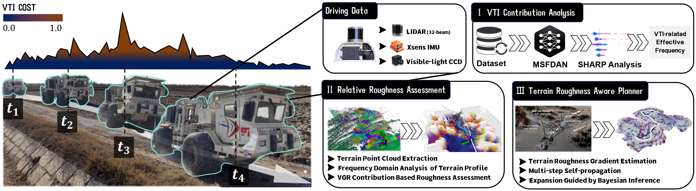

# TRA-planner
This repository provides code for terrain-aware autonomous navigation, including roughness analysis based on vehicle-terrain interaction and a graph-based path planner with Bayesian learning.

## 💡Note
The code will be released upon acceptance of the corresponding paper. We apologize for any inconvenience this may cause and appreciate your understanding.
## 💻Prerequisites
- Ubuntu 20.04 and ROS Noetic
- PCL >= 1.10 (default for Ubuntu 20.04)
- Eigen >= 3.3.4 (default for Ubuntu 20.04)
- GTSAM >= 4.0.3 (test on 4.2(a))
- fftw-3.3.10
- pyTorch >= 1.10
- numpy>=1.21
- python>=3.8
- Gazebo 11 (optional; only required if you intend to perform simulation testing)
## 📌Maintaince
We are still working on extending the proposed system and improving code reliability.
For any technical issues, please contact Tianwei Niu (ntwbit@bit.edu.cn) or Haoyu yuan (3120230769@bit.edu.cn).